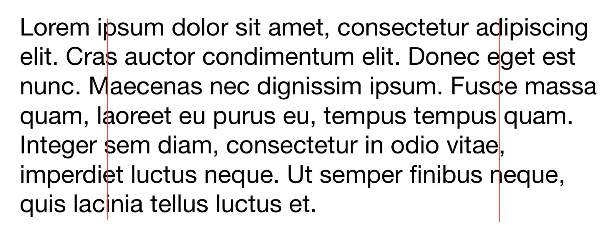
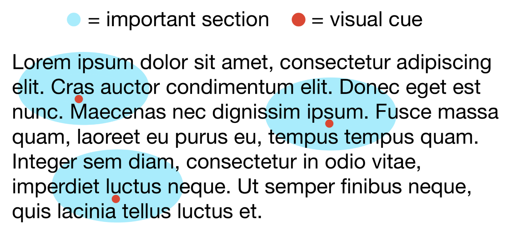

# Underlines to Help Speed Read
Speed reading is challenging. I want to make an app to teach me how to speed read. Before I dive into the details, let's recap how speed reading works.

To speed read, you read multiple words at once. Reading each word is slow because your eyes can read many words at once. By placing your eyes on the best spots, you can absorb the most information while reading the same text.

My first idea was to iteratively fade away each word on the page, putting you in a race against the disappearing text. However, challenging sections may make us pause or refer to earlier paragraphs for context. Whoops! They're gone, tough luck.

A better solution should keep all words on the page:
   1. We should generate guiding lines.
        - A faster way to read is to never focus on text near the edges of the page. It would be best if you stopped around an inch away from the page to avoid reading every word. To train ourselves, we can overlay guiding lines to know where to place our focus.

  

These cues are great, but what about the text in the middle?

   2. We should place markers on the most important regions of the page.

        - The eye doesn't continuously scan across each line on the page. Instead, it rests on several points on each line.
        - We can use markers to determine where to focus.

  

Finding where to place these visual cues is the hard part. Here are some ideas I've thought of:

- We can monitor actual speed readers and determine where they focus their gaze.
- We can look for important words/concepts using clustering techniques in the text. (This is a whole ramble on ML stuff),
- We can also place cues near difficult vocabulary.
    - We can customize this heuristic for your vocabulary by importing your Goodreads dictionary or taking a brief quiz.

I love this idea because this solution works wherever there is text. Messenger.com? Check. Wikipedia? Check.

I also like this idea because it keeps the website's layout intact. By using the visual cues, information is accessible as we read, not sidelined into a popup sidebar. We also don't have to change how we read webpages because the markers are innocuous suggestions.

I'm quite willing to put together a prototype for this idea, but I'm doing a bit of Thinking Fast and Slow before I start.

\- Curtis