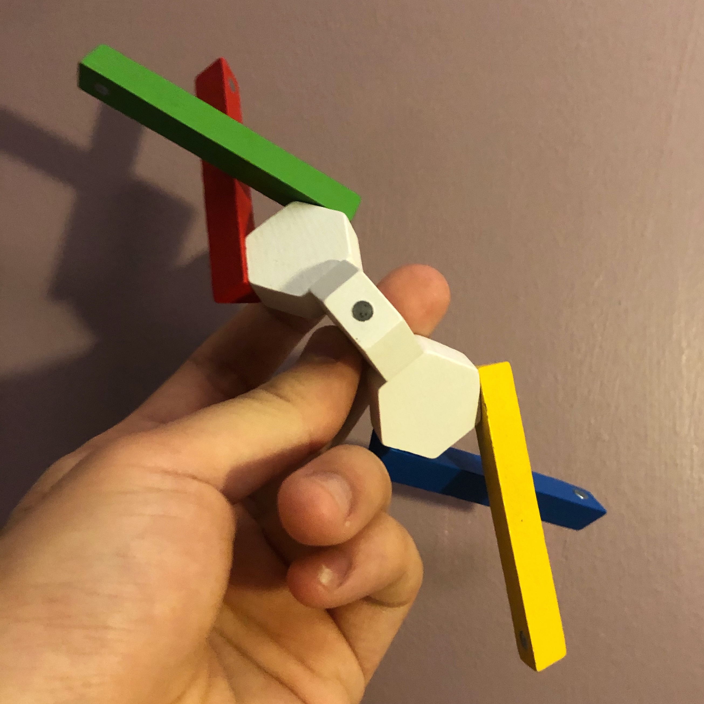

# Designing Logos by Playing with Blocks

I was playing with magnetic blocks yesterday, and I made this logo:

  

I never made a logo before, and I would've never thought of this design if I had to draw it out on paper.

What if designers could play with blocks to get inspiration for designs?

I really like this idea because designers can fix problematic designs in the physical world by rearranging blocks instead of dragging and rotating shapes on their laptops.

We can spark even more creativity by restricting the magnet's location on the blocks, encouraging artists to arrange blocks in novel ways.

To prototype curves, users can shape flexible blocks made out of sturdy pipe cleaners.

To simplify the digitization process, we can use computer vision to snapshot the design into a CAD model or an outline sketch. Afterwards, designers can finalize specifics on the computer before pitching their plans to the team.

I'll see you next week!

\- Curtis

P.S. We can use this concept to design other objects like props in a film or door handles. I guess I'm trying to find more excuses to play with these blocks.

<!--START OF FOOTER-->

<!--START OF ISSUE NAVIGATION LINKS-->

<a href='035_technical_interviews_for_writing_pull_requests.md'>#35: Technical Interviews for Writing Pull Requests</a>&nbsp;&nbsp;|&nbsp;&nbsp;<a href='037_qr_codes_for_robotic_construction.md'>#37: QR Codes for Robotic Construction</a>

<!--START OF ISSUE NAVIGATION LINKS-->
<!--END OF FOOTER-->
