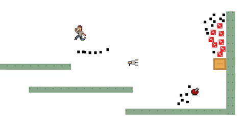

# A New Art Style: Particle Effects

A few years ago, I made a game for school and snapped this /Jif/:

  

I love staring at this scene to this day because of the particle effects. It's SO satisfying to see the blue portal fly across the screen, leaving a trail of light dots before finally disappearing.

Or the thin lines that the blocks leave behind as the TNT blows it up.

Aside from its use as a screensaver, I think particle effects can evolve into an art form in exhibitions because it offers a type of art on an entirely new wavelength.

Much like how a rich and broad spectrum of notes harmonizes a great symphony, these particle effects can complement art shows through variety.

Moreover, they fill in the visual harmony that many exhibitions lack by expressing the elements of design through animation and time.

Now imagine being a kid again.

I would compare this experience to watching raindrops skid across the window of the family car as you return home on Saturday. You just want to see which raindrop will win the race to the bottom of the window!

Being a kid was fun. And I hope you find some new art to enjoy this week!

\- Curtis

<!--START OF FOOTER-->

<!--START OF ISSUE NAVIGATION LINKS-->

<a href='037_qr_codes_for_robotic_construction.md'>#37: QR Codes for Robotic Construction</a>&nbsp;&nbsp;|&nbsp;&nbsp;<a href='039_a_metric_to_replace_test_coverage.md'>#39: A Metric to Replace Test Coverage</a>

<!--START OF ISSUE NAVIGATION LINKS-->
<!--END OF FOOTER-->
