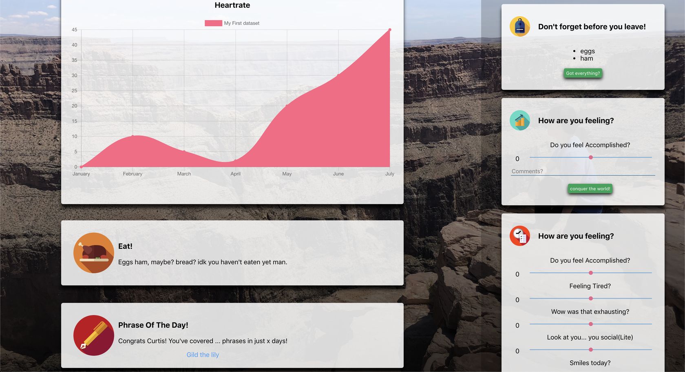

# A Newsfeed for Your Life

Two years ago, I wanted to build a Newsfeed for my life. It was going to have pretty graphs about:
- My internet usage.
- The types of songs I've listened to recently.
- My heart rate.
- And my sleep.

It would also be cool if there were other information on the newsfeed:
- Popular posts from the UWaterloo Reddit (since I don't check it frequently).
- Popular posts on Kaggle (since I was competing in their competitions).
- And new phrases I want to learn (from books I've read).

Lastly, I wanted it to deliver notifications to:
- Chat with friends I haven't spoken to recently.
- "Count my wins" when I feel down.
    - And to play happier songs!
- Challenge me to say bad words only once that day.
- And to finish Todoist cards that have been backlogged without love.

Since I was pretty obsessed with data collection at the time, I also wanted it to log my moods. The whole project was an excuse to correlate how I felt with what I did.

Here's a rough MVP of it:

  

Regrettably, I lost motivation after a few months because I had to write too much code before having enough features to be beneficial. I was also discouraged because I needed to use it for many months before I could analyze any long-term trends.

And you know what? Your phone already does half of these features. So if I were to attempt this again, I'd definitely start on the most unique features and try to make it worthwhile for myself. It would also be more fun if I worked on it with a couple of friends.

Anyway, if you're interested in looking at the code, I've linked it [here](https://github.com/curtischong/lnews). It's a bit rough, but the spirit's there. With that, l hope that you have a lot of fun this week!

\- Curtis

<!--START OF FOOTER-->

<!--START OF ISSUE NAVIGATION LINKS-->

<a href='057_using_neural_nets_to_assist_therapists.md'>#57: Using Neural Nets to Assist Therapists</a>&nbsp;&nbsp;|&nbsp;&nbsp;<a href='059_connecting_smart_people_to_problems.md'>#59: Connecting Smart People to Problems</a>

<!--START OF ISSUE NAVIGATION LINKS-->
<!--END OF FOOTER-->
