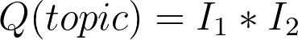
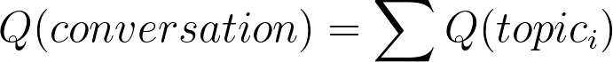

# A Metric for Lovely Conversations

###### First posted on September 6, 2021

You're radiant. And I want to learn more about you... but I'm not sure what you'd like to talk about. So I try to stick to the basics of a lovely chat:

- Find common ground we're both passionate about.
- Listen well.
- Learn something from you.
- Ask open-ended questions.
- Don't pontificate.
- Don't equate my experience to yours.
- Leave out the exact details of a story.
- etc.

I like sticking to the basics because they're guaranteed. But sometimes, there's just so much to follow. So I wanted to encapsulate all these rules of thumb into a single metric for conversation quality. Here's my attempt at creating one:

A lovely conversation happens when everyone in the conversation pitches in ideas. Specifically, we can model the quality of a conversation topic with this formula:

  

Where I1 and I2 are the number of ideas contributed by each person in the conversation.

"Ideas" is a broad word, but I think it should include:

- Jokes
- Observations
- Connections to other topics
- Lessons learned

I think that this is a good start because the score is highest when both people contribute a lot to the topic. Naturally, the more they contribute, the more invested they are in the conversation. You also have to listen well to be able to formulate ideas.

I also love Q(topic) because it rewards insightful questions. If you ask a fantastic "why" question that steers the conversation into an area that teaches something insightful about ourselves, it leads to so many more opportunities to pitch ideas.

Moreover, if only one person talks, the score becomes 0 because others may feel distanced. (Note: This metric doesn't work when a friend is venting to you or when someone is sharing an engaging story. You don't want to interrupt them.)

Lastly, since a conversation can span multiple topics, I think that the quality of the chat should be the sum of all topic quality scores:

  

I think a summation is appropriate since it rewards longer conversations and signals that we both like talking to each other.

Anyway, there are so many more aspects of conversation we haven't discussed. But it's a start. And hey, if you've got more ideas, please pitch them to me! It'll be lovely.

\- Curtis

<!--START OF FOOTER-->

<!--START OF ISSUE NAVIGATION LINKS-->

<a href='067_paying_0_to_10_a_month_for_netflix.md'>#67: Paying $0 to $10 a Month for Netflix</a>

<!--START OF ISSUE NAVIGATION LINKS-->
<!--END OF FOOTER-->
