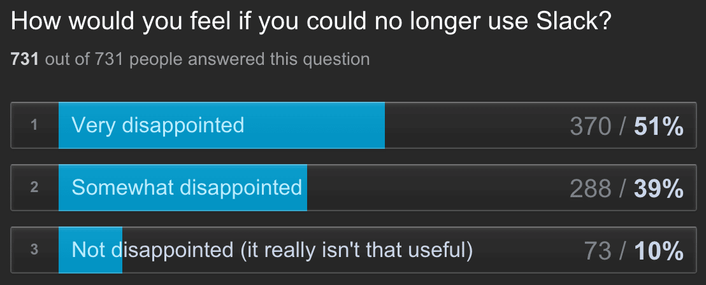

# Measuring Product-Market Fit for YouTubers

###### First posted on October 4, 2021

The 40% rule is a metric that companies use to test if they have Product-Market Fit. This means that their users can't live without their product and tell all their friends about it - like Roam Research :)

Here's how the 40% rule works. You first ask your users:
 

  

If 40+% of your users say "Very disappointed," then you have product-market fit and should focus on your company's growth.

Otherwise, you have to improve your product OR your change product's target audience. It's widely known that if 40+% of users are "very disappointed" without the product, then the startup should focus more on growth rather than improving their product.

So I was wondering if we could apply a similar metric to content creators. How can YouTubers know whether to focus on growth or to focus on their content?

I think that it's a bit of a loaded question because it's hard to focus on making better content since people are more creative when they create more. The more videos you produce, the higher chance that one of them will be stellar.

However, most social platforms aren't a complete meritocracy, so I guess people can focus on beating the algorithms rather than improving their content quality.

One metric could be to measure what percentage of your subscribers watch your videos. But this metric is a bit lacking because people may miss it on their subscriptions page.

But okay, isn't there a small group of fans that can convert and ultimately sign up for your Patreon or buy your merch? Aren't these the fans that indicate product-market fit? I guess? But not everyone has the financial stability to pledge.

The problem is that measuring product-market fit through these variables probably won't work because they're just proxies. So I think to measure product-market fit for content creators, you'll have to ask the same question as the one that Slack asked:

How would you feel if you could no longer read Sleepovers?

1. Very disappointed
2. Somewhat disappointed
3. Not disappointed

I'm not sure if the threshold is still 40% for content creators, but it's still a standard to strive for. Thanks for reading this, and I'll see you next week!

\- Curtis

P.S. You can learn more about the metric here: [www.pisano.com/blog/sean-ellis-test-figure-out-product-market-fit](https://www.pisano.com/blog/sean-ellis-test-figure-out-product-market-fit)

<!--START OF FOOTER-->

<!--START OF ISSUE NAVIGATION LINKS-->

<a href='069_treasuring_friendships.md'>#69: Treasuring Friendships</a>&nbsp;&nbsp;|&nbsp;&nbsp;<a href='071_a_search_engine_that_has_your_back.md'>#71: A Search Engine That Has Your Back</a>

<!--START OF ISSUE NAVIGATION LINKS-->
<!--END OF FOOTER-->
