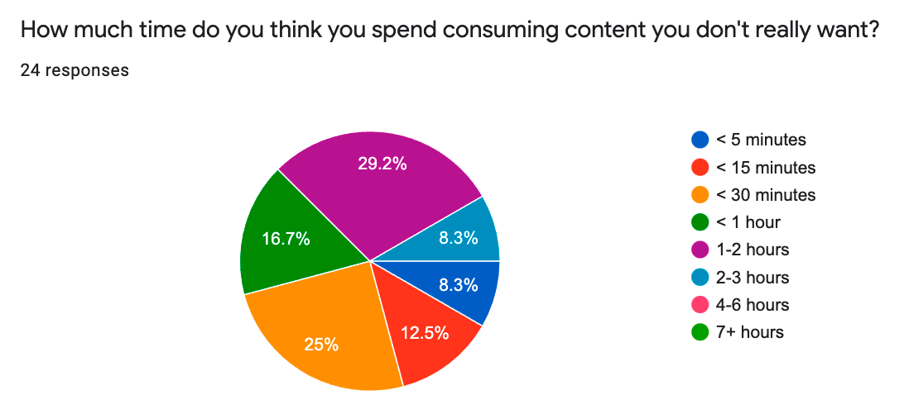
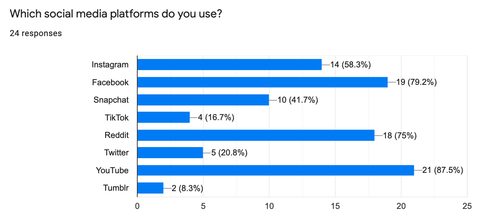
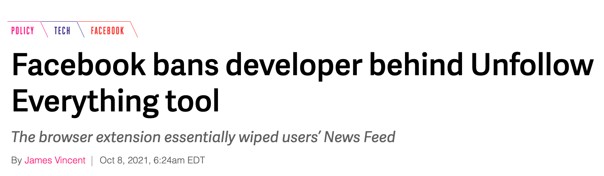

# Making Social Media Less Addictive

###### First posted on October 25, 2021

Social media is pretty addictive. How addictive? I don't know, so my friends and I asked our class:

  

So we had an idea. What if we built an app to filter content from social media sites. One way to limit your use is only to show 3-5 posts every 12 hours. We could also run algorithms to remove clickbaity posts. This would avert users from clicking on recommended posts and diving deep into rabbit holes for half an hour.

But which social media should we build this app for? We weren't sure, so we asked:
 

  

 

From our experience, these distributions make sense. So we planned to retrieve the posts from Facebook, Instagram, Reddit, and YouTube first.

So we began writing code.

And it was fun, but after working on it for two weeks, we hit a brick wall:

  

He was banned for life. I guess you can tell what we did next. We ceased work because none of us wanted the same fate.

So right now, we're back to square 1 and have to figure out a project we'd want to work on. But that's okay. It's all part of the process. Anyway, I hope that you enjoy your week and look forward to the next!

\- Curtis

P.S. You can read more about Unfollow Everything <a href="https://www.theverge.com/2021/10/8/22716044/facebook-unfollow-everything-tool-louis-barclay-banned-for-life">here</a>.

<!--START OF FOOTER-->

<!--START OF ISSUE NAVIGATION LINKS-->

<a href='072_learning_by_auto_grouping_our_notes.md'>#72: Learning by Auto-grouping Our Notes</a>&nbsp;&nbsp;|&nbsp;&nbsp;<a href='075_encoding_nonverbal_communication_in_writing.md'>#75: Encoding Nonverbal Communication in Writing</a>

<!--START OF ISSUE NAVIGATION LINKS-->
<!--END OF FOOTER-->
