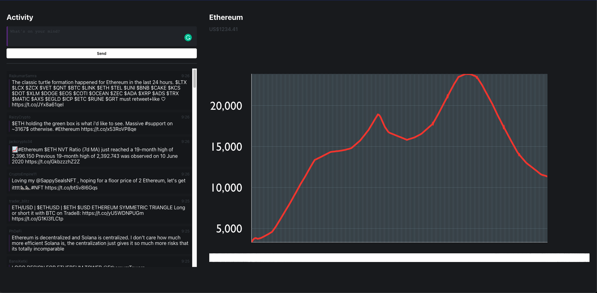

# Preventing $500 GCP Bills

###### First posted on December 6, 2021

I made a small mistake and spent $500 hosting this game we made at Hack the North.

  

At least we can sell ETH at $12k to cover our tab.

I wish that credit cards were more tech-ey. Isn't it weird how we find out our bill after paying for a service?

Why can't credit cards:

- Send merchants info about our "spending limits" beforehand?
- Declare an estimated "acceptable spending limit" for a specific type of charge beforehand?

Why can't service providers:

- Tell our credit cards an estimate of our charges earlier on?
- Send us email estimates of costs earlier on?
- Ask credit cards if paying for this service aligns with our spending habits?
- Offer to set up a "stop-loss" option (in the billing screen) to stop charging after $20 or 3 days of service?
- Charge credit cards over a daily cycle so we can identify charges earlier?
- Charge credit cards a small $0.01 fee at the start to notify banks that we signed up for this service?

The ecosystem doesn't have to be so closed. Instead, banks could build a simple API like this to offer checks to prevent stress.

But it's okay if banks don't work on this. Crypto payment services will definitely offer these checks and balances down the road. Actually, if you're working at Stripe, I'd really appreciate it if you pitched this.

As for my bill, we lucked out. Google graciously waived our bill even though it was entirely my fault. They didn't have to, but they still reimbursed me, so thank you so much if you work there!

Anyway, good luck with your finals, and I hope that we'll persevere in this final week!

\- Curtis

P.S. You have to watch the movie Wargames from 1983, which is about a high school programmer trying to access a mysterious computer network. Even though it's old, the themes touched on were decades ahead of their time and still holds up well today. It's my favourite film this year.

<!--START OF FOOTER-->

<!--START OF ISSUE NAVIGATION LINKS-->

<a href='075_encoding_nonverbal_communication_in_writing.md'>#75: Encoding Nonverbal Communication in Writing</a>&nbsp;&nbsp;|&nbsp;&nbsp;<a href='077_automatically_generating_regex.md'>#77: Automatically Generating Regex</a>

<!--START OF ISSUE NAVIGATION LINKS-->
<!--END OF FOOTER-->
