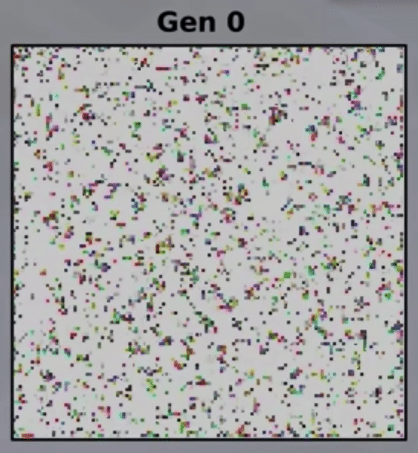

# Online Judges for Evolution Simulators

###### First posted on December 27, 2021

Every year I send my friend a programming challenge for his birthday. If he can solve the challenge, he wins an Amazon gift card.

This year, he has to find a genome that will offer simulated creatures the highest chance of survival. If the creatures have suitable genes to survive the round, they will pass on their genes to their children. Over time, the simulation goes from this:
 

  

To this:
 

  

The best creatures realized that moving to the corners of the map leads to survival.

But how will I know that my friend's solution (a genome) leads to a high survival rate? How can I test his submission?

Well, we can give all the creatures in the simulation the submitted genome and see what happens.

This technique of "running" someone's solution is called "online judging." These judges are used to check if an answer is one of the many possible correct solutions. Websites such as Leetcode or Kaggle are famous examples of online judges.

Online judges are lovely because they can teach people new skills. I definitely wouldn't have learned dynamic programming without Leetcode or some ML without Kaggle.

Since online judges are great teachers, I believe that many other problems deserve an online judge because they can accelerate learning. Why are online judges only allowed for people in tech?

So I encourage you to ask around to find what problems your non-tech friends find hard and see if an online judge can evaluate that problem.

If you create an online judge, I think the vital ingredient to get right is to cultivate a vibrant community with a strong desire to help others improve. Compassionate communities are essential because most learning happens when we read how others have approached the problem. So the more people help each other, the faster we all learn and "level up."

Anyway, I hope you had a great Christmas, and I hope you have an even better week!

\- Curtis
 
 

P.S. You can watch a video about the evolution simulator here.

P.P.S. I recognize that "Leetcodifying" problems in other disciplines could bring the dreaded "technical interview" to other fields. Whether that's good or not is another discussion entirely and depends on the field/problem, so I'll leave it as food for thought :)

<!--START OF FOOTER-->

<!--START OF ISSUE NAVIGATION LINKS-->

<a href='078_wikipediafying_books_to_make_reading_fun.md'>#78: Automatically Generating Regex</a>

<!--START OF ISSUE NAVIGATION LINKS-->
<!--END OF FOOTER-->
