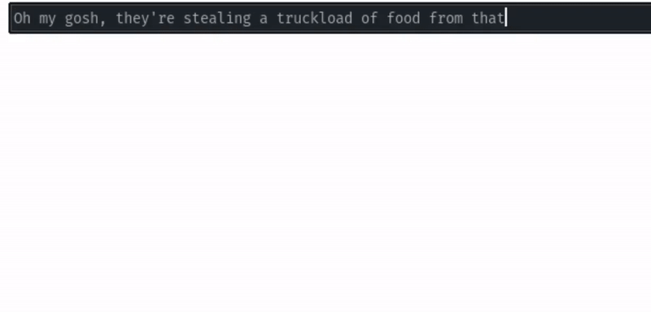
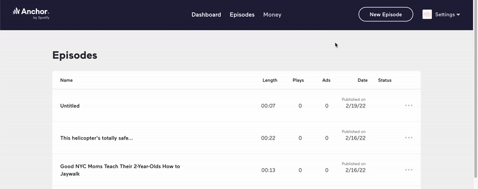
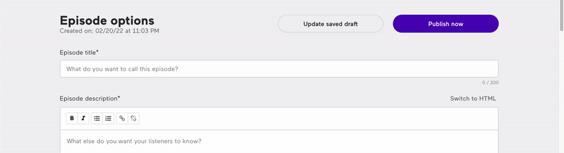

# Recording and Publishing Podcasts in 15 Seconds

###### First posted on Feb 21, 2022

Sometimes the best way to be creative is to take a break. Sometimes the best way to take a break is to indulge in late-night programming sessions and build some software:

  

  

  

This is my joke recorder & publisher. And I spent too much time building it. But who cares? It was fun, and now I have a tool to publish jokes with a few keypresses.

I think that people undervalue tools like these, especially if it’s for a creative pursuit. Even though it doesn’t save much time, it’s still worth creating these tools because it makes the process more enjoyable.

Life becomes more fun.

And I think that if the creative process isn’t that fun, you’ll find excuses to avoid creativity. Anyhow, that’s all I wanted to share. I hope you have a great time this week and love the work you do.

\- Curtis

<!--START OF FOOTER-->

<!--START OF ISSUE NAVIGATION LINKS-->

<a href='083_is_____funny.md'>#83: Is ___ Funny?</a>&nbsp;&nbsp;|&nbsp;&nbsp;<a href='085_my_personal_grammarly.md'>#85: My Personal Grammarly </a>

<!--START OF ISSUE NAVIGATION LINKS-->
<!--END OF FOOTER-->
