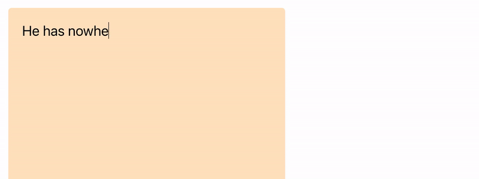
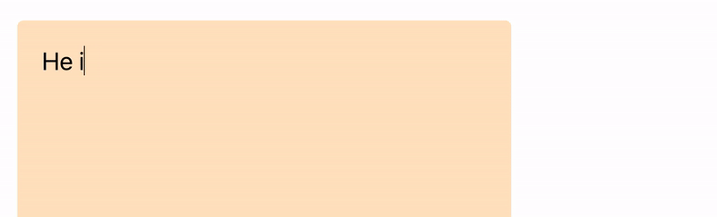

# My Personal Grammarly 

###### First posted on March 2, 2022

Every once in a while, I fall in love with a project that I really want to exist. So last year, I spent a month trying to write my own Grammarly editor. But instead of suggesting grammar corrections, this editor would help refine my writing.
As a proof of concept, I programmed it to:

 
1) Give my writing flare by suggesting idioms to use

  

 
2) Help me form similes by offering nouns to insert after adjectives.

  

 
3) Find-and-replace text that matches terms in my dictionary

  

It was really fun, but like with all projects, life finds a way to enlist you into a school term.

I guess what I'm trying to say is that I had a lot of fun working on this, even if I never used it. In a sense, this project is an artwork I admire, and I get really nostalgic whenever I turn it on.

Anyway, thank you so much for reading this and I hope you have a joyful week!

\- Curtis

<!--START OF FOOTER-->

<!--START OF ISSUE NAVIGATION LINKS-->

<a href='084_recording_and_publishing_podcasts_in_15_seconds.md'>#84: Recording and Publishing Podcasts in 15 Seconds</a>

<!--START OF ISSUE NAVIGATION LINKS-->
<!--END OF FOOTER-->
