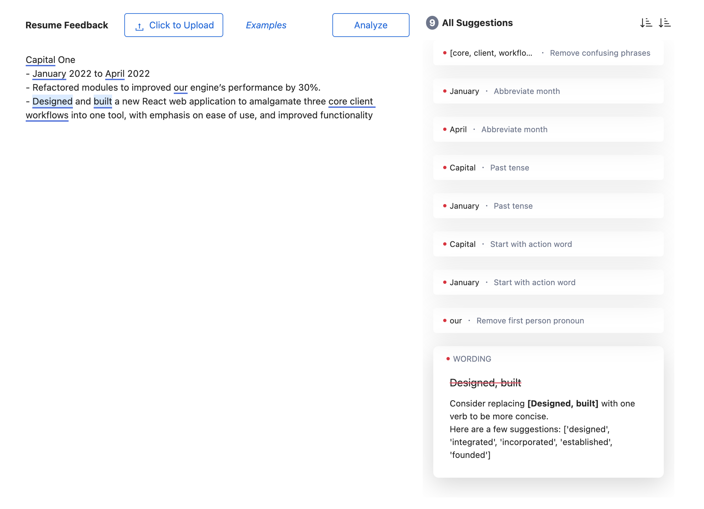

# Grammarly for Cold Emails

###### First posted on Mar 23, 2023

 
My heart's beating at a mile a minute cause I just emailed my dream company asking for a job.
 
 

_Bzzzzz_
 
 
Was that them? I'm too scared to check because I'd rather live in Schrödinger's bliss.
 
 

_Bzzzz Bzzzzz Bzzzzz_
 
 
I had to check. Someone opened my email seven times. No, 8.
 
 
What?
 
 
The CTO forwarded my email to every team lead. A week later, I talked to one of them. That chat was the lucky break I needed to spend a summer at Grammarly.

 

 

So what was in that email?
- An A/B-tested subject line with an ~80% open rate:
    - "I'd Love to Work for Grammarly. Are you Looking for Summer Interns?"
- A sentence asking the CTO to forward the email to others who had more ability to take action.
- 24 more tips for just $24.99!
 
 

Nahhh just kidding.
 
 
It's common to see YouTube videos or a course teaching tricks like these. They teach me a lot, but they aren't that helpful because the advice isn't specific to the current cold email I'm writing.

That's why Grammarly is such a great product. The app proofreads everything you type and tailors suggestions to your current document.

So why can't online courses be the same? Well, they can. My friends and I wrote an app that's like Grammarly but for resumes:

  

This is a much nicer experience for the user because the feedback is instant and specific. You no longer have to watch a 3-hour course to learn the tricks.

This app can reach far beyond teaching people how to write resumes or cold emails. It could help people:
- Sharpen their college entrance essays.
- Write realistic screenplay dialogue.
- Simplify their calculus proofs.
- Be more sensitive when helping out a distressed friend.

But I can't program all these "tips and tricks" into the editor, so we'll need a marketplace of creators to help. And now that we have LMMs, it'll be much simpler for ordinary people to program these rules.

Anyway, I hope you're doing well. If we haven't talked recently, we should call or meet up! And as always, I hope you have a wonderful week.

\- Curtis

<!--START OF FOOTER-->

<!--START OF ISSUE NAVIGATION LINKS-->

<a href='098_technology_to_divert_hurricanes.md'>#98: Technology to Divert Hurricanes</a>

<!--START OF ISSUE NAVIGATION LINKS-->
<!--END OF FOOTER-->
