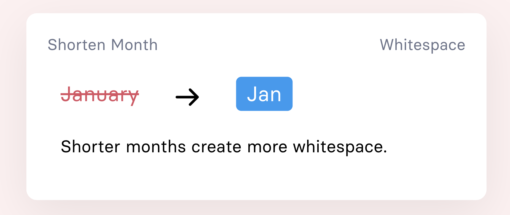

# Grammarly for Anything

###### First posted on Dec 18, 2023

After graduation, I was working on a startup with some friends. But three weeks ago, I realized I didn't care about the company's vision.

So I quit.

Unemployed, I did the only thing I knew that would make me happy:

Create something I've always dreamed of - Grammarly, but for:

- Writing resumes
- Writing jokes
- Editing Sleepovers
- Writing anything!

  

 

I've yearned for this tool because it tailors feedback for the sentence you just wrote.

Traditionally, if you want to learn something, we'd watch a video and try to implement those tips into our writing. But we'd often forget the advice or aren't keen enough to notice flaws in our writing. This tool fixes our writing while teaching us those tips.

It makes learning interactive, rather than passive.

The core logic is just prompt engineering, so if you have clever cold-emailing tricks, you can write a "check" that will proofread soon-to-be-sent emails.

You can try it out now at [checklet.page](https://checklet.page). I hope someone finds this helpful, even if it's just to proofread your resume once a semester.

Happy holidays!

\- Curtis

<!--START OF FOOTER-->

<!--START OF ISSUE NAVIGATION LINKS-->

<a href='101_players_cause_city_wide_blackout_to_win_a_battle_chatting_with_eve_onlines_ceo.md'>#101: Players Cause City-wide Blackout to Win a Battle - Chatting with Eve Online’s CEO</a>&nbsp;&nbsp;|&nbsp;&nbsp;<a href='103_phds_are_replacing_formulas_with_neural_nets.md'>#103: PhDs Are Replacing Formulas with Neural Nets</a>

<!--START OF ISSUE NAVIGATION LINKS-->
<!--END OF FOOTER-->
