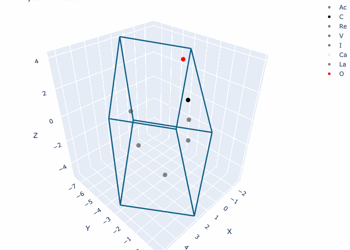
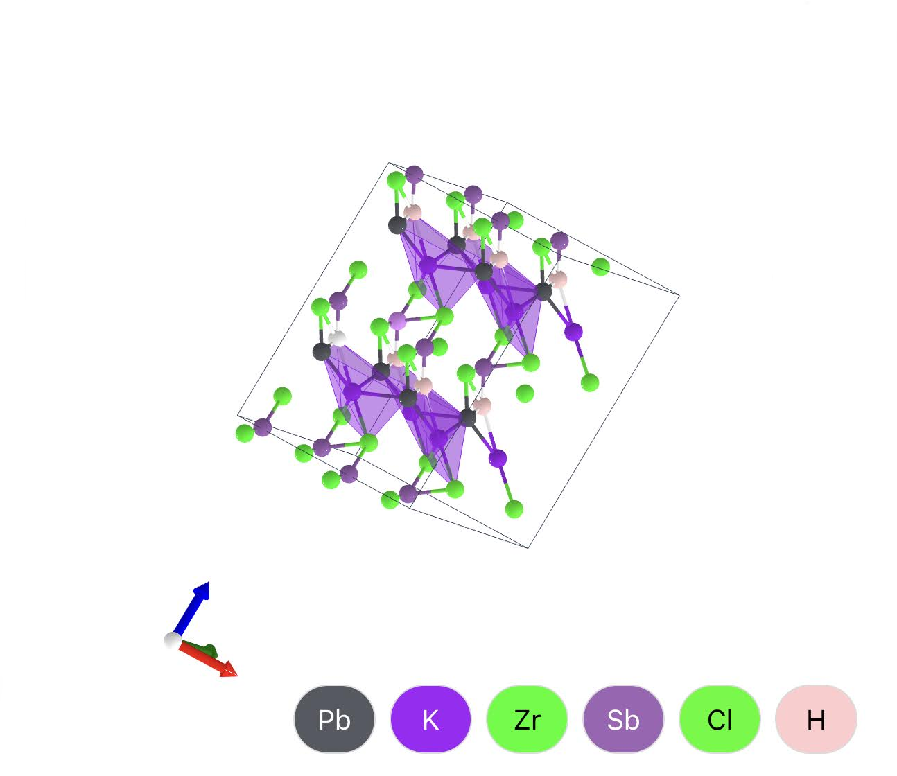

# Using Diffusion to Discover New Materials

###### First posted on Apr 22, 2024

How do scientists discover new materials? They use brute force:

1) They take an existing material and substitute one atom with another atom.
2) Next, they take this new candidate material and check to see if it has the desired properties.

This is inefficient because the way they generate new candidates is random. Since the search space for all possible materials is immense (10^60), random approaches are unlikely to discover new materials near the boundaries of physics. This approach also biases researchers to find materials that already look like existing materials.

We could explore the search space more efficiently by asking computers to: "Generate me a new material with these specific strength/electromagnetic/thermal conductivity properties."

This is a more directed approach to material search because the model suggests candidates based on its intuition of the chemical space.

So, I trained a diffusion model that generates realistic-looking crystals:

  

 
 

  

There's still a long way to go, so for the first time in Sleepovers, I'm asking for your help. I need friends to work on this project with. It'd be really cool if we built an algorithm that found room-temperature superconductors.

So if you know someone, please forward them this email! I’m also looking for a place to stay in Boston for May. So if you know of a couch I could rent please let me know!

I hope you've been doing really well, and I wish you the best of weeks!

\- Curtis

<!--START OF FOOTER-->

<!--START OF ISSUE NAVIGATION LINKS-->

<a href='104_making_unhackable_servers.md'>#104: Making Unhackable Servers</a>

<!--START OF ISSUE NAVIGATION LINKS-->
<!--END OF FOOTER-->
