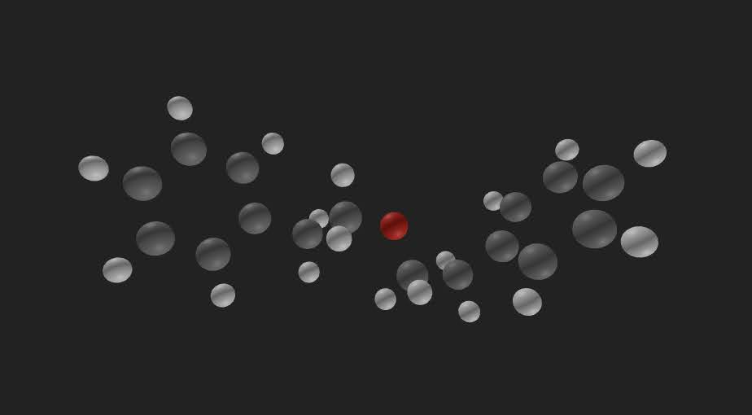

# How to Build the Model That Discovers Matter

###### First posted on Nov 21, 2024

We currently have neural networks that input/output text, images, and audio.

In the future, we’ll expand the input and output modalities to include point clouds (a collection of atoms and their positions):

  

Imagine asking a computer to design a drug with specific properties. In addition to your instructions, you pass in the coordinates of each atom of a sample drug. The model then talks with itself (train-of-thought) to iterate on the drug by shifting the coordinates of each atom (or adding new ones) until the final arrangement has the desired properties.

The train-of-thought (thinking process) is required because it’s impractical to simulate an entire organism to observe how a drug affects a human. So, we need to use reasoning to evaluate and improve a drug’s structure.

If we can teach a computer to do this, personalized medicines (drugs designed for your specific body) would become widespread.

This technology is the panacea.

Drugs are just the starting point. If these models existed, the hunt for high-entropy alloys, super ionic conductors, and room-temperature superconductors would be swiftly won.

The path to get there is getting clearer. This future just needs lots of engineers to train the models. I find that really exciting because individuals can have an outsized impact in the field's direction. That's about it! I hope you're doing well and are having a great day!

\- Curtis

<!--START OF FOOTER-->

<!--START OF ISSUE NAVIGATION LINKS-->

<a href='105_using_diffusion_to_discover_new_materials.md'>#105: Using Diffusion to Discover New Materials</a>

<!--START OF ISSUE NAVIGATION LINKS-->
<!--END OF FOOTER-->
